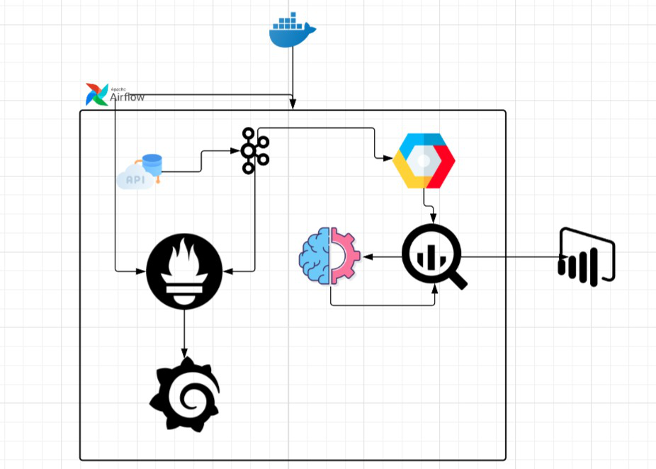

# 🐄 Smart Dairy Farm Monitoring System

This project implements a robust, ML-powered telemetry pipeline for modern dairy farm management. It simulates, ingests, processes, and analyzes cow sensor data to generate actionable insights such as health status, milk yield forecast, and fertility prediction.

---

## 🚀 Overview

Managing hundreds or thousands of cows requires automation. This project combines real-time data pipelines and machine learning models to:

- Monitor cow health
- Forecast milk yield
- Predict fertility cycles

Built using Kafka, Airflow, BigQuery, Docker, and Prometheus, this pipeline runs fully automated daily ML tasks with scalability and reliability in mind.


---

## 📊 Machine Learning Pipelines

### 1. Cow Health Monitoring
- **Model**: Random Forest Classifier
- **Goal**: Predict `health_status` as `healthy`, `at-risk`, or `unwell`
- **Features**: Temperature, heart rate, rumination, etc.
- **Output**: BigQuery → `cow_health_monitoring_table`

### 2. Milk Yield Forecasting
- **Model**: Regression (Random Forest)
- **Goal**: Predict next-day milk yield per cow (liters)
- **Features**: Rumination time, body temperature
- **Output**: BigQuery → `milk_yield_predictions`

### 3. Fertility Prediction
- **Model**: Gradient Boosting Classifier
- **Goal**: Predict if a cow is fertile (`fertile` or `not_fertile`)
- **Features**: Activity level, temperature, rumination
- **Output**: BigQuery → `fertility_prediction`

---

## ⚙️ Data Pipeline Components

| Step         | Description                                                    |
|--------------|----------------------------------------------------------------|
| Kafka        | Ingests and streams telemetry data using a bounded random walk |
| Airflow DAGs | Orchestrates training and prediction tasks for each ML model   |
| GCS/NDJSON   | Stores intermediate feature data and model outputs             |
| BigQuery     | Stores final predictions for dashboards and alerts             |
| Docker       | Ensures reproducible environment and deployment                |
| Prometheus   | Monitors metrics like DAG health, ingestion rates, errors      |

---


---

## 📦 Model Artifacts

| Task              | Model File Path                                      |
|-------------------|------------------------------------------------------|
| Cow Health        | `/opt/airflow/dags/scripts/models/cow_health_model.joblib` |
| Milk Yield        | `/opt/airflow/dags/ml_models/yield_model.pkl`         |
| Fertility         | `/opt/airflow/dags/scripts/models/fertility_model.joblib`  |

---

## 🕒 Daily Execution Flow

1. Sensor data is simulated and sent to Kafka.
2. Feature extraction and aggregation runs hourly.
3. Airflow DAGs execute daily ML pipelines:
   - Retrain models (configurable)
   - Predict using fresh data
   - Save to BigQuery

---

## 📉 Monitoring

- **Prometheus** scrapes metrics from exporters (Kafka, Airflow, etc.)
- **Grafana** visualizes ingestion stats, DAG success rates, model drift, etc.

---

## 💡 Scalability Notes

- Kafka partitions can be increased for 10x throughput.
- Pipeline supports adding new sensor types with minimal config.
- Can scale from 1,000 to 1M cows using GCP-native tools (e.g., Pub/Sub, Dataflow).

---

## 🧪 Sample Prediction Output (NDJSON)

```json
{
  "cow_id": "cow_101",
  "feature_hour": "2025-05-27T10:00:00Z",
  "predicted_label": "at-risk",
  "prediction_time": "2025-05-27T12:00:00Z"
}
